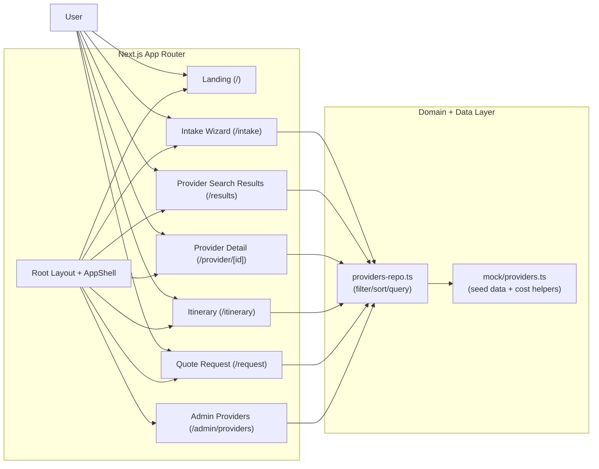

# High-Level Architecture

## Legend

- `App Router`: User-facing pages and shared shell/layout.
- `Domain + Data Layer`: In-process TypeScript modules for provider querying and trip-cost estimation.
- This version is mock-data based (no live external APIs in the runtime flow).
