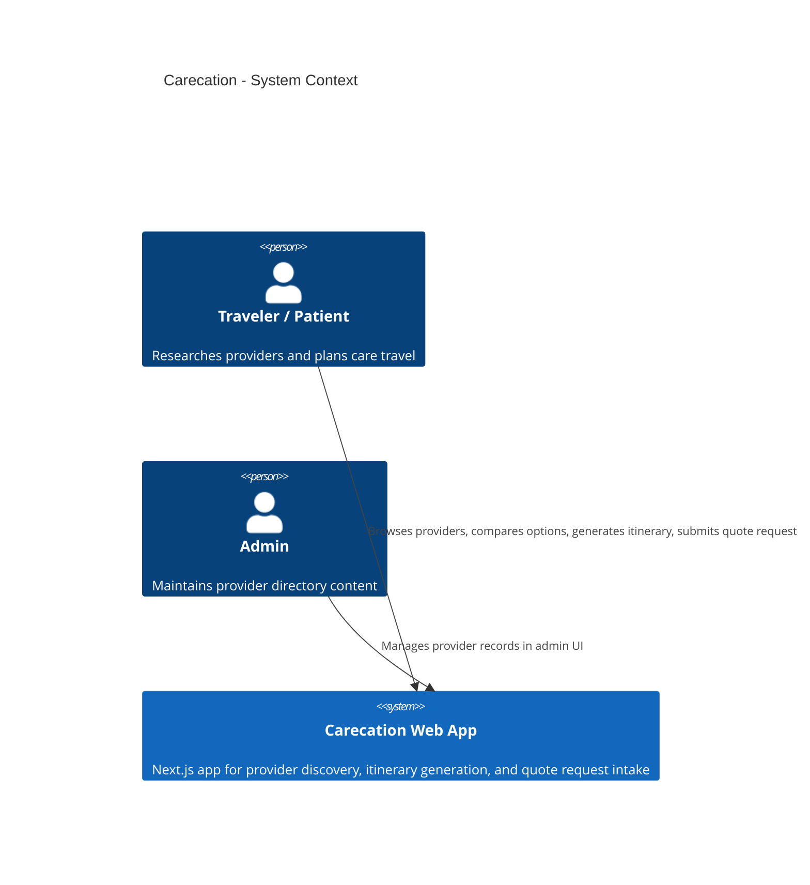

# C4 Context Diagram

```mermaid
C4Context
title Carecation - System Context

Person(user, "Traveler / Patient", "Researches providers and plans care travel")
Person(admin, "Admin", "Maintains provider directory content")
System(carecation, "Carecation Web App", "Next.js app for provider discovery, itinerary generation, and quote request intake")

Rel(user, carecation, "Browses providers, compares options, generates itinerary, submits quote request")
Rel(admin, carecation, "Manages provider records in admin UI")
```

## Legend

- `Person`: Human actors interacting with the platform.
- `System`: The Carecation application boundary.
