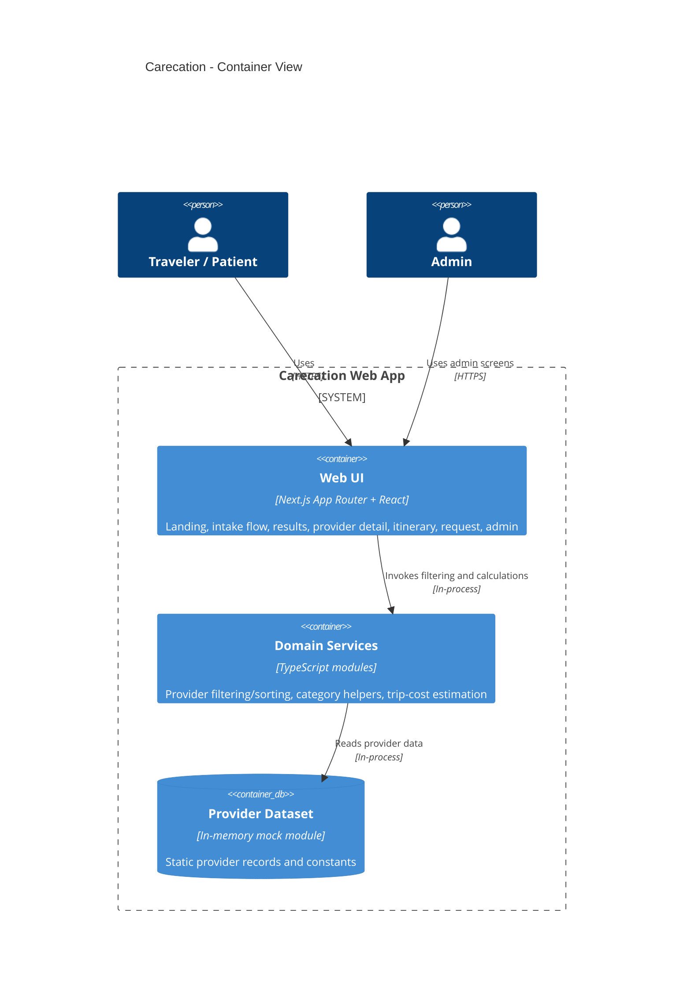

# C4 Container Diagram

## Legend

- `Web UI`: All page-level UI and navigation.
- `Domain Services`: Business logic for querying providers and computing estimate ranges.
- `Provider Dataset`: Current static/mock data source.
