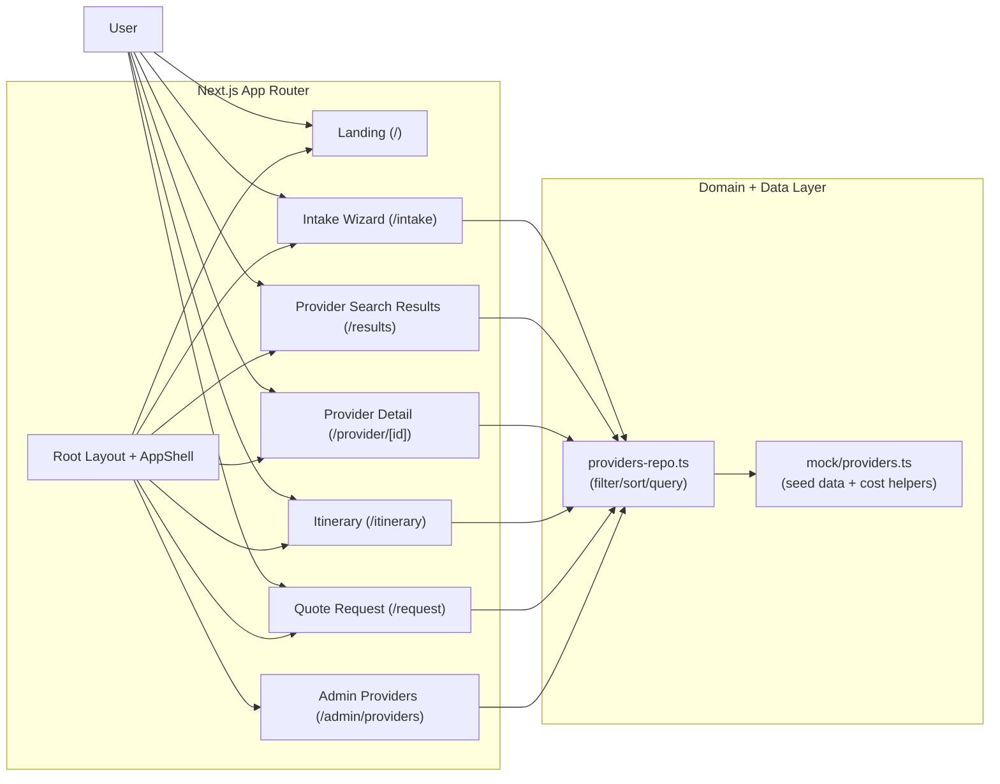
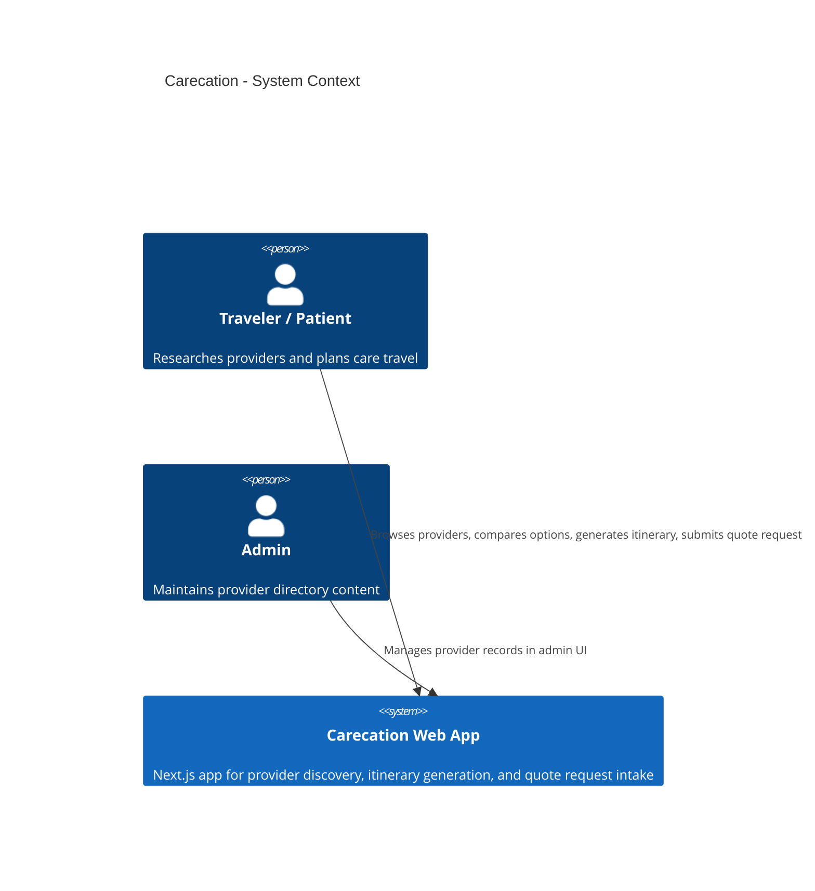
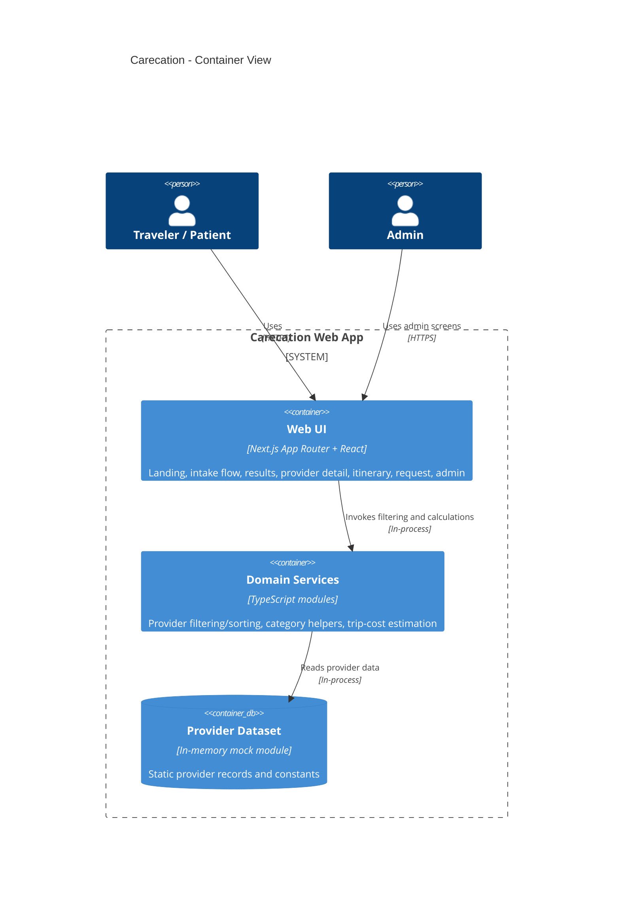

# Architecture Diagrams

This folder contains three Mermaid architecture diagrams:

1. [High-Level Architecture](./01-high-level.md)
2. [C4 Context](./02-c4-context.md)
3. [C4 Container](./03-c4-container.md)

---

## 1) High-Level Architecture

## 2) C4 Context

## 3) C4 Container

